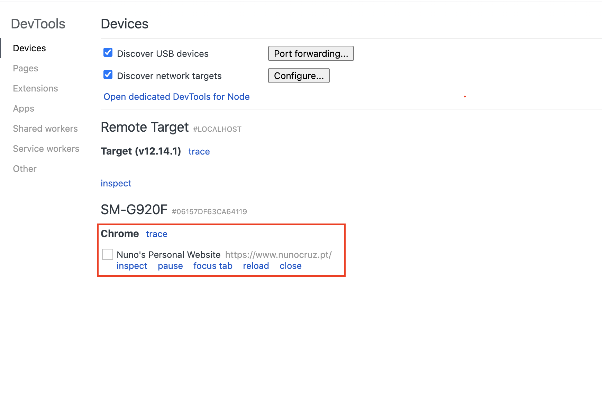
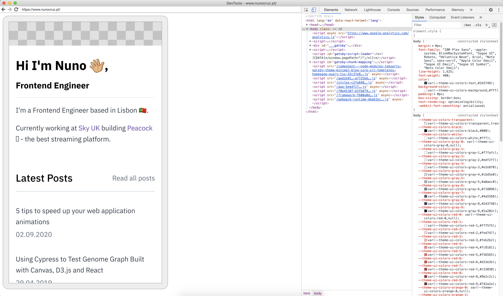

# How to Remote Debugging Android Devices

Chrome lets you remote debugging any webpage running in an Android Device. To do so, you have to:

1. [Connect the Android device with your development machine](https://developers.google.com/web/tools/chrome-devtools/remote-debugging).
2. Once the device is correctly connected, access the page in your Android device.
3. After accessing the page, you should see the following:

4. Click in "Inspect" and a new window will open with the DevTools.

You can also access webpages that are being served by the developement machine. To do so, besides following the previous steps, you have to:

1. Enable port forwarding. The tutorial [Access Local Servers](https://developers.google.com/web/tools/chrome-devtools/remote-debugging/local-server) explains how to enable it.